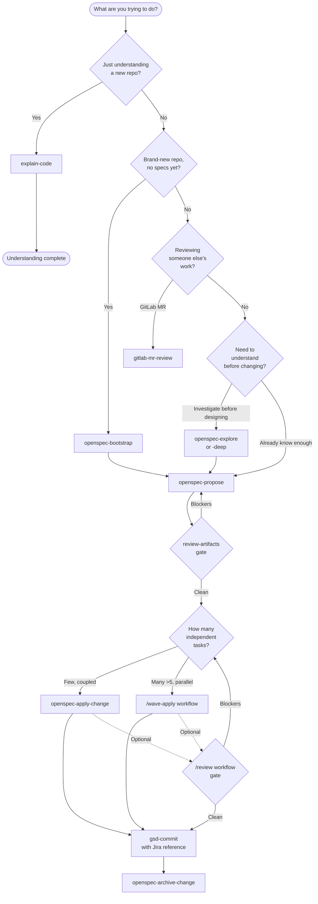

# carl-workflow

A spec-driven, review-gated workflow for shipping software with Claude Code. Bundles 22 skills, a CLAUDE.md template, and an install script. Stack-agnostic — works on any codebase you can run `git` in.

This repo is a **methodology + skill bundle**, not a fork of Claude Code. You install the skills into your existing Claude Code setup; the methodology is the prose around them.

---

## Quickstart

```sh
git clone https://github.com/<your-handle>/carl-workflow.git
cd carl-workflow
./install/install.sh           # copies skills/* into ~/.claude/skills/
```

**Prereqs**

- [Claude Code](https://claude.com/claude-code) installed and authenticated.
- Optional: the [`openspec`](https://github.com/Fission-AI/OpenSpec) CLI for the OpenSpec family.
- Optional: [`glab`](https://gitlab.com/gitlab-org/cli) for the GitLab MR review skill.
- Bash (macOS/Linux). Windows: use WSL.

The installer is **idempotent** — re-run with `--force` to refresh existing skill copies. See `install/install.sh --help` for `--prefix`, `--dry-run`, and `--force` flags.

---

## The 7-phase flow



The arrows above are the happy path. For full routing — including `openspec-sync-specs`, `gsd-context-handoff`, and the single-persona reviewers — see [docs/decision-tree.md](./docs/decision-tree.md). For the narrative explanation of each phase, see [docs/methodology.md](./docs/methodology.md). For the four session patterns that produce expert-level results, see [docs/session-shapes.md](./docs/session-shapes.md).

---

## When to use what

| Situation | Skill / Workflow | Doc |
|---|---|---|
| Start a session (load context + readiness check) | `gsd-session-primer` | [gsd.md](./docs/skills/gsd.md) |
| Let the workflow decide what to do | `carl-dispatch` | [gsd.md](./docs/skills/gsd.md) |
| Adopt the workflow on an existing repo | `openspec-bootstrap` | [openspec.md](./docs/skills/openspec.md) |
| Understand existing code before touching it | `explain-code` | [explain-code.md](./docs/skills/explain-code.md) |
| Investigate before designing | `openspec-explore` (or `-deep`) | [openspec.md](./docs/skills/openspec.md) |
| Design a feature, refactor, or bugfix | `openspec-propose` | [openspec.md](./docs/skills/openspec.md) |
| Validate a proposal before coding | `review-artifacts` | [review.md](./docs/skills/review.md) |
| Implement a small / coupled change | `openspec-apply-change` | [openspec.md](./docs/skills/openspec.md) |
| Implement many independent tasks (with specs) | `/wave-apply` workflow | [wave-apply.js](./workflows/wave-apply.js) |
| Parallel ad-hoc work (no specs needed) | `/fan-out` workflow | [fan-out.js](./workflows/fan-out.js) |
| High-stakes review with adversarial verification | `/review` workflow | [review.js](./workflows/review.js) |
| Quick review (lower ceremony) | `review-code` skill | [review.md](./docs/skills/review.md) |
| Close out a completed change | `openspec-archive-change` | [openspec.md](./docs/skills/openspec.md) |
| Update canonical specs without archiving | `openspec-sync-specs` | [openspec.md](./docs/skills/openspec.md) |
| Review a teammate's GitLab merge request | `gitlab-mr-review` | [gitlab-mr-review.md](./docs/skills/gitlab-mr-review.md) |
| Debugging with unclear root cause | Agent team (3-5 teammates) | [session-shapes.md](./docs/session-shapes.md) |

---

## Dynamic Workflows

Three saved [dynamic workflows](https://code.claude.com/docs/workflows) that orchestrate subagents at scale. Unlike skills (instructions the model follows turn by turn), workflows are JavaScript scripts the runtime executes deterministically — loops, branches, and intermediate results are code, not context.

Requires Claude Code v2.1.154+. Installed to `~/.claude/workflows/` by `install.sh`.

| Workflow | What it does | Agents | When to use |
|----------|-------------|--------|-------------|
| `/wave-apply` | Wave execution with schema-validated classification, inter-wave verification gates, cross-failure test analysis | 10-50+ | OpenSpec change with 5+ independent tasks |
| `/review` | Multi-dimensional review (arch/ts/qa/devops/security) with adversarial verification — 2 skeptics try to refute each finding | 10-20 | After implementation, high-stakes changes |
| `/fan-out` | Lightweight parallel execution for ad-hoc goals | 4-12 | 2-5 independent tasks without OpenSpec ceremony |

### Triggering workflows

```sh
# Run a saved workflow directly
/wave-apply
/review
/fan-out "add error boundaries to all page components"

# Ad-hoc workflow for any task — include "ultracode" in your prompt
ultracode: audit every API endpoint for missing auth checks

# Persistent ultracode mode for the session
/effort ultracode
```

### How they improve on the skill equivalents

| Skill (prompt-driven) | Workflow (script-driven) |
|---|---|
| Model interprets retry logic from prose | `while` loop with exit conditions |
| Intermediate results fill context window | Results stay in script variables |
| Classification is a heuristic the model applies | Schema-validated structured output |
| No adversarial verification | N skeptics per finding before reporting |
| Not resumable | Cached — resume picks up where it left off |

### Agent Teams (experimental)

For tasks requiring inter-agent *debate* rather than just parallel execution — competing-hypothesis debugging, cross-layer feature coordination, research sessions that need adversarial testing.

```sh
# Enable agent teams
export CLAUDE_CODE_EXPERIMENTAL_AGENT_TEAMS=1
# Or in ~/.claude/settings.json:
# { "env": { "CLAUDE_CODE_EXPERIMENTAL_AGENT_TEAMS": "1" } }

# Then ask Claude to spawn teammates:
# "Spawn 3 teammates to investigate why the auth flow fails intermittently"
# "Spawn teammates for frontend, backend, and test layers"
```

See [docs/session-shapes.md](./docs/session-shapes.md) for Shape 5 (Workflow-Orchestrated) and Shape 6 (Agent-Team Investigation).

---

## Skill catalog

22 bundled skills across three families, a routing layer, and two standalones. See [docs/skills/](./docs/skills/) for per-family documentation.

- **[OpenSpec](./docs/skills/openspec.md)** — `openspec-bootstrap`, `openspec-explore`, `openspec-explore-deep`, `openspec-propose`, `openspec-apply-change`, `openspec-archive-change`, `openspec-sync-specs`
- **[GSD](./docs/skills/gsd.md)** (wave execution + session management) — `gsd-classify-tasks`, `gsd-wave-apply`, `gsd-commit`, `gsd-context-handoff`, `gsd-session-primer`, `gsd-preflight`, `gsd-fan-out`, `gsd-metrics`
- **[Review](./docs/skills/review.md)** — `review-artifacts`, `review-code`, `review-arch`, `review-qa`, `review-ts`, `review-devops`
- **Routing** — `carl-dispatch` (intent classification + pre-flight context loading)
- **[explain-code](./docs/skills/explain-code.md)** — standalone teaching-mode walkthrough
- **[gitlab-mr-review](./docs/skills/gitlab-mr-review.md)** — standalone GitLab MR reviewer

---

## Pain points & gotchas

Recurring failure modes from real AI-coding sessions, each with a CLAUDE.md snippet that prevents recurrence. See [docs/pain-points.md](./docs/pain-points.md) for the full set with mitigations.

- **Environment config drift** (`.env` vs `.env.local`) — agent reads stale or wrong env, often silently. Snippet: tell Claude which env file your framework actually loads.
- **Test mock isolation** — module-level state and env-at-import-time leak across tests. Snippet: `vi.resetModules()` rules and import-time env capture.
- **Working-directory sensitivity** — skills silently misbehave when invoked from the wrong cwd. Snippet: pin the expected working directory in CLAUDE.md.

---

## Adapting to your project

1. Copy `install/CLAUDE.md.template` to `<your-project>/CLAUDE.md`.
2. Fill in the stack / architecture / code style sections for your project.
3. Paste the snippets you want from `examples/claude-md-snippets/`:
   - [`openspec-flow.md`](./examples/claude-md-snippets/openspec-flow.md) — the 7-phase flow rules
   - [`review-protocol.md`](./examples/claude-md-snippets/review-protocol.md) — severity framework + reviewer roles
   - [`gsd-execution.md`](./examples/claude-md-snippets/gsd-execution.md) — wave execution rules (optional)

The methodology stays constant; only the stack-specific sections of CLAUDE.md change between projects.

---

## Versioning & updates

Re-run `./install/install.sh --force` after `git pull` to refresh the installed copies in `~/.claude/skills/`. The installer backs up existing dirs to `<name>.bak.<timestamp>` before replacing.

To uninstall, `./install/uninstall.sh --force`. It only touches dirs whose names match this repo's `skills/` and prompts before each deletion.

---

## VS Code Agents (Copilot Chat)

The same workflow is available as VS Code custom agents for GitHub Copilot Chat. Instead of slash-command skills, you get `@agent` mentions with built-in handoff routing.

### Install

```sh
cd carl-workflow
./vscode/install.sh --target /path/to/your/project
```

This copies `.agent.md` files into `<project>/.github/agents/` — the standard VS Code discovery path. Re-run with `--force` to update. Use `./vscode/uninstall.sh` to remove.

### Agent catalog

| Agent | Role | Handoffs to |
|-------|------|-------------|
| `@Carl` | Intent router — describe what you want, get routed | All agents |
| `@Explore` | Investigate before designing (read-only) | Propose, Explore Deep |
| `@Explore Deep` | Multi-subsystem deep investigation | Propose |
| `@Propose Change` | Create change artifacts (proposal, design, tasks) | Review: Artifacts, Apply |
| `@Apply Change` | Implement tasks from an OpenSpec change | Review: Code |
| `@Review: Artifacts` | Pre-implementation review (Architect + QA) | Propose (fix), Apply (proceed) |
| `@Review: Code` | Post-implementation review (TS/React + DevOps) | Apply (fix blockers) |
| `@Review: Architecture` | Architecture-focused review | Propose (fix) |
| `@Review: QA` | QA/spec completeness review | Propose (fix) |
| `@Review: TypeScript` | TypeScript/React code quality | Apply (fix) |
| `@Review: DevOps` | Deploy-readiness, security, build health | Apply (fix) |
| `@Explain Code` | Teaching-mode code walkthrough | — |
| `@GitLab MR Review` | Summarize + review a GitLab MR | — |

### Handoff mode

Handoffs are the agent-to-agent routing system. Two ways to trigger them:

**1. Via `@Carl` (recommended)**

Start any conversation with `@Carl` and describe your intent. Carl checks project state (OpenSpec status, git branch, uncommitted work) and routes to the right specialist:

```
@Carl I want to add user authentication
→ routes to @Propose Change

@Carl review what I just implemented
→ routes to @Review: Code
```

**2. Via handoff buttons**

Each agent offers handoff buttons at natural transition points. After Explore surfaces findings, click **"Ready to propose a change"** to hand off to Propose. After Apply finishes tasks, click **"Review the implementation"** to hand off to Review: Code.

The buttons appear in Copilot Chat as clickable actions — no need to remember agent names or retype context.

### The handoff chain (happy path)

```
@Carl → @Explore → @Propose Change → @Review: Artifacts → @Apply Change → @Review: Code
```

Each handoff carries context forward. Carl's state-awareness means it can also jump you to the right point mid-flow (e.g., if artifacts exist but aren't reviewed yet, Carl routes directly to Review: Artifacts).

---

## Architecture

For the layered mental model (user → Claude Code → skills → artifacts → repo), the tool-roles table, and where artifacts live on disk, see [docs/architecture.md](./docs/architecture.md).

---

## Credits

- **OpenSpec** — the spec-driven change management approach the openspec-* skills are built on.
- **GSD (Get Shit Done)** — the wave-execution pattern the gsd-* skills implement.
- **APD (API Design Principles)** and **CLI skill packs** — referenced but not bundled in this repo. They're cross-cutting and live upstream; install them separately if you want them.

---

## License

[MIT](./LICENSE).
