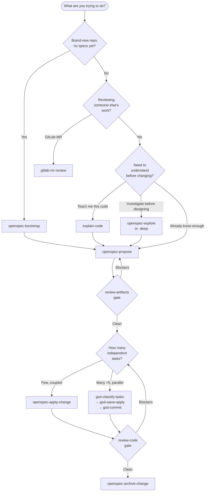

# carl-workflow

A spec-driven, review-gated workflow for shipping software with Claude Code. Bundles 22 skills, a CLAUDE.md template, and an install script. Stack-agnostic — works on any codebase you can run `git` in.

This repo is a **methodology + skill bundle**, not a fork of Claude Code. You install the skills into your existing Claude Code setup; the methodology is the prose around them.

---

## Quickstart

```sh
git clone https://github.com/<your-handle>/carl-workflow.git
cd carl-workflow
./install/install.sh           # copies skills/* into ~/.claude/skills/
```

**Prereqs**

- [Claude Code](https://claude.com/claude-code) installed and authenticated.
- Optional: the [`openspec`](https://github.com/Fission-AI/OpenSpec) CLI for the OpenSpec family.
- Optional: [`glab`](https://gitlab.com/gitlab-org/cli) for the GitLab MR review skill.
- Bash (macOS/Linux). Windows: use WSL.

The installer is **idempotent** — re-run with `--force` to refresh existing skill copies. See `install/install.sh --help` for `--prefix`, `--dry-run`, and `--force` flags.

---

## The 7-phase flow



The arrows above are the happy path. For full routing — including `openspec-sync-specs`, `gsd-context-handoff`, and the single-persona reviewers — see [docs/decision-tree.md](./docs/decision-tree.md). For the narrative explanation of each phase, see [docs/methodology.md](./docs/methodology.md). For the four session patterns that produce expert-level results, see [docs/session-shapes.md](./docs/session-shapes.md).

---

## When to use what

| Situation | Skill | Doc |
|---|---|---|
| Start a session (load context + readiness check) | `gsd-session-primer` | [gsd.md](./docs/skills/gsd.md) |
| Let the workflow decide what to do | `carl-dispatch` | [gsd.md](./docs/skills/gsd.md) |
| Adopt the workflow on an existing repo | `openspec-bootstrap` | [openspec.md](./docs/skills/openspec.md) |
| Understand existing code before touching it | `explain-code` | [explain-code.md](./docs/skills/explain-code.md) |
| Investigate before designing | `openspec-explore` (or `-deep`) | [openspec.md](./docs/skills/openspec.md) |
| Design a feature, refactor, or bugfix | `openspec-propose` | [openspec.md](./docs/skills/openspec.md) |
| Validate a proposal before coding | `review-artifacts` | [review.md](./docs/skills/review.md) |
| Implement a small / coupled change | `openspec-apply-change` | [openspec.md](./docs/skills/openspec.md) |
| Implement many independent tasks (with specs) | `gsd-classify-tasks` → `gsd-wave-apply` → `gsd-commit` | [gsd.md](./docs/skills/gsd.md) |
| Parallel ad-hoc work (no specs needed) | `gsd-fan-out` | [gsd.md](./docs/skills/gsd.md) |
| Validate a diff before archiving | `review-code` | [review.md](./docs/skills/review.md) |
| Close out a completed change | `openspec-archive-change` | [openspec.md](./docs/skills/openspec.md) |
| Update canonical specs without archiving | `openspec-sync-specs` | [openspec.md](./docs/skills/openspec.md) |
| Review a teammate's GitLab merge request | `gitlab-mr-review` | [gitlab-mr-review.md](./docs/skills/gitlab-mr-review.md) |

---

## Skill catalog

22 bundled skills across three families, a routing layer, and two standalones. See [docs/skills/](./docs/skills/) for per-family documentation.

- **[OpenSpec](./docs/skills/openspec.md)** — `openspec-bootstrap`, `openspec-explore`, `openspec-explore-deep`, `openspec-propose`, `openspec-apply-change`, `openspec-archive-change`, `openspec-sync-specs`
- **[GSD](./docs/skills/gsd.md)** (wave execution + session management) — `gsd-classify-tasks`, `gsd-wave-apply`, `gsd-commit`, `gsd-context-handoff`, `gsd-session-primer`, `gsd-preflight`, `gsd-fan-out`, `gsd-metrics`
- **[Review](./docs/skills/review.md)** — `review-artifacts`, `review-code`, `review-arch`, `review-qa`, `review-ts`, `review-devops`
- **Routing** — `carl-dispatch` (intent classification + pre-flight context loading)
- **[explain-code](./docs/skills/explain-code.md)** — standalone teaching-mode walkthrough
- **[gitlab-mr-review](./docs/skills/gitlab-mr-review.md)** — standalone GitLab MR reviewer

---

## Pain points & gotchas

Recurring failure modes from real AI-coding sessions, each with a CLAUDE.md snippet that prevents recurrence. See [docs/pain-points.md](./docs/pain-points.md) for the full set with mitigations.

- **Environment config drift** (`.env` vs `.env.local`) — agent reads stale or wrong env, often silently. Snippet: tell Claude which env file your framework actually loads.
- **Test mock isolation** — module-level state and env-at-import-time leak across tests. Snippet: `vi.resetModules()` rules and import-time env capture.
- **Working-directory sensitivity** — skills silently misbehave when invoked from the wrong cwd. Snippet: pin the expected working directory in CLAUDE.md.

---

## Adapting to your project

1. Copy `install/CLAUDE.md.template` to `<your-project>/CLAUDE.md`.
2. Fill in the stack / architecture / code style sections for your project.
3. Paste the snippets you want from `examples/claude-md-snippets/`:
   - [`openspec-flow.md`](./examples/claude-md-snippets/openspec-flow.md) — the 7-phase flow rules
   - [`review-protocol.md`](./examples/claude-md-snippets/review-protocol.md) — severity framework + reviewer roles
   - [`gsd-execution.md`](./examples/claude-md-snippets/gsd-execution.md) — wave execution rules (optional)

The methodology stays constant; only the stack-specific sections of CLAUDE.md change between projects.

---

## Versioning & updates

Re-run `./install/install.sh --force` after `git pull` to refresh the installed copies in `~/.claude/skills/`. The installer backs up existing dirs to `<name>.bak.<timestamp>` before replacing.

To uninstall, `./install/uninstall.sh --force`. It only touches dirs whose names match this repo's `skills/` and prompts before each deletion.

---

## Architecture

For the layered mental model (user → Claude Code → skills → artifacts → repo), the tool-roles table, and where artifacts live on disk, see [docs/architecture.md](./docs/architecture.md).

---

## Credits

- **OpenSpec** — the spec-driven change management approach the openspec-* skills are built on.
- **GSD (Get Shit Done)** — the wave-execution pattern the gsd-* skills implement.
- **APD (API Design Principles)** and **CLI skill packs** — referenced but not bundled in this repo. They're cross-cutting and live upstream; install them separately if you want them.

---

## License

[MIT](./LICENSE).
