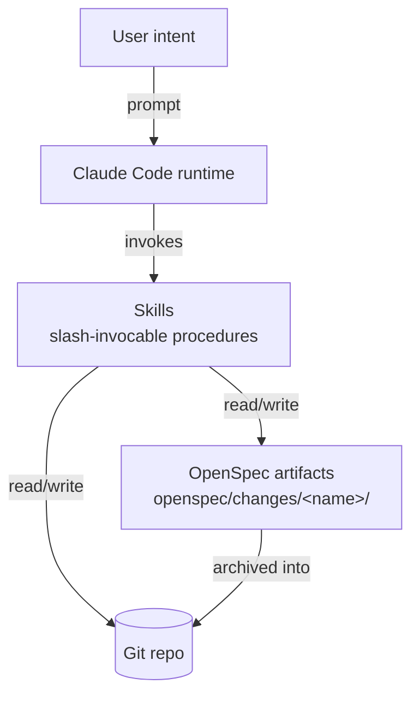

# Architecture

## Mental model

This workflow is a layered system built on top of Claude Code. Each layer translates the layer above into something more concrete and durable: human intent becomes agent action, agent action becomes invocable procedure, procedure produces written artifacts, and artifacts land in the only thing that survives a `rm -rf` of your laptop — the git repo. Top-down:

1. **The user's intent** — what you want to ship, expressed in natural language.
2. **Claude Code** — the agent runtime that turns that intent into reads, edits, and tool calls.
3. **Skills** — composable, slash-invocable procedures (`/opsx:propose`, `/review-code`, etc.) that scope Claude Code to a specific job.
4. **OpenSpec artifacts** — the durable change record under `openspec/changes/<name>/` (proposal, design, tasks, delta specs).
5. **The git repo** — the ultimate source of truth. Everything above is scaffolding around commits.

The layers are deliberately one-way: skills write artifacts, artifacts shape commits, commits define reality. Nothing below ever depends on something above still being in memory.

## Tool roles

| Tool | Role in the workflow | Required? |
|------|----------------------|-----------|
| **Claude Code** | Agent runtime. Reads the repo, runs skills, writes artifacts and code. | Yes |
| **`git`** | Source of truth. Branches, commits, and history are how changes ship. | Yes |
| **A code editor** | Human read/write surface for reviewing diffs and editing artifacts. Any editor works. | Yes |
| **`openspec` CLI** | Initializes `openspec/` scaffolding, lists active changes, validates artifacts. Powers the `openspec-*` and `opsx:*` skills. | Optional |
| **`glab` CLI** | GitLab MR review and PR/MR creation from the terminal. Required for `gitlab-mr-review` and the GitLab side of `apd-create-pr`. | Optional |
| **`gh` CLI** | GitHub equivalent — PRs, issues, checks from the terminal. | Optional |
| **A package manager** (`pnpm`/`npm`/`yarn`) | Installs the `openspec` CLI and any project-local tooling the skills shell out to. | Optional |

## Diagram

The arrows are deliberately asymmetric: skills can touch both artifacts and the repo, but artifacts only flow one way — into the repo via archive. The runtime never edits skills, and skills never rewrite user intent.

## Where artifacts live

Canonical paths the workflow writes to and reads from:

- `openspec/changes/<change-name>/` — the active change folder. Contains `proposal.md`, `design.md`, `tasks.md`, and `specs/<feature>/spec.md` deltas.
- `openspec/specs/<feature>/` — the canonical, living specs. Updated when a change is archived (`/opsx:archive`) or sync'd (`/opsx:sync`).
- `~/.claude/skills/<name>/` — installed skill sources, available to every project on the machine.
- `<repo>/.claude/skills/<name>/` — project-local skill overrides. Same name as a global skill takes precedence when invoked from this repo.
- `CLAUDE.md` (project root) — project instructions Claude Code reads automatically on session start. The right place for stack rules, conventions, and workflow gates.

## Extension points

The workflow is meant to be bent to your stack, not adopted whole.

- **Custom skills.** Drop a new skill folder into `~/.claude/skills/` (machine-wide) or `<repo>/.claude/skills/` (project-only). Each skill is a directory with a `SKILL.md` and any supporting scripts; Claude Code discovers them on session start.
- **CLAUDE.md snippets.** Encode project-specific rules — stack choices, review gates, file naming, test placement — in the repo's `CLAUDE.md`. Reusable snippets live under [../examples/claude-md-snippets/](../examples/claude-md-snippets/).
- **Composed slash-commands.** Chain existing skills into your own higher-level command. A `/ship-it` that runs `/opsx:apply` then `/review-code` then `/opsx:archive` is just a skill that calls the others in order.
