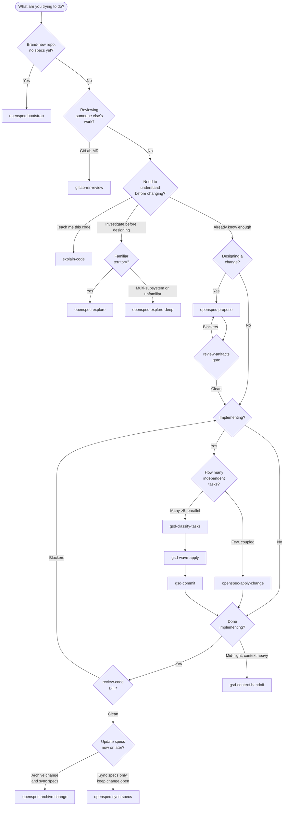

# Decision Tree

Companion to the methodology: pick the right skill for what's in front of you.

## Visual flow

## When-to-use matrix

| Situation | Skill | Why | Doc |
|---|---|---|---|
| Adopting AI workflow on existing repo for first time | `openspec-bootstrap` | Generates initial-architecture + per-feature specs from working code so future proposals have context | [openspec.md](./skills/openspec.md) |
| Curious how an existing module works | `explain-code` | Teaching-mode walkthrough of files, functions, data flows, and infra calls | [explain-code.md](./skills/explain-code.md) |
| Investigating before designing a change | `openspec-explore` | Single-threaded thinking partner; reads code, asks questions, sketches options | [openspec.md](./skills/openspec.md) |
| Investigation spans multiple subsystems or unfamiliar territory | `openspec-explore-deep` | Fans out parallel investigators, synthesizes a single picture | [openspec.md](./skills/openspec.md) |
| Designing a feature, refactor, or bugfix | `openspec-propose` | Generates proposal + design + specs + tasks in one step | [openspec.md](./skills/openspec.md) |
| Validating a proposal before coding | `review-artifacts` | Architect + QA reviewers catch design and spec gaps before they cost rework | [review.md](./skills/review.md) |
| Implementing a small or coupled change | `openspec-apply-change` | Sequential, single-context loop through tasks.md | [openspec.md](./skills/openspec.md) |
| Implementing many independent tasks in parallel | `gsd-classify-tasks` then `gsd-wave-apply` | Classify dependencies, then run isolated subagents per wave | [gsd.md](./skills/gsd.md) |
| Validating a diff before archiving | `review-code` | TS/Frontend + DevOps reviewers catch quality and deploy-readiness issues | [review.md](./skills/review.md) |
| Single feature commit after wave execution | `gsd-commit` | Reads change artifacts to write a verb-phrase commit covering the whole wave | [gsd.md](./skills/gsd.md) |
| Preserving state before `/clear` | `gsd-context-handoff` | Writes a handoff doc so the next session resumes mid-change | [gsd.md](./skills/gsd.md) |
| Closing out a completed change | `openspec-archive-change` | Confirms completion, optionally syncs specs, moves change to archive | [openspec.md](./skills/openspec.md) |
| Updating canonical specs without archiving | `openspec-sync-specs` | Applies delta specs to main specs while change stays active | [openspec.md](./skills/openspec.md) |
| Reviewing a teammate's GitLab merge request | `gitlab-mr-review` | Posts a code summary to the MR and runs the standard reviewer pair | [gitlab-mr-review.md](./skills/gitlab-mr-review.md) |
| Need only one reviewer perspective | `review-arch` / `review-qa` / `review-ts` / `review-devops` | Single-persona variants for targeted feedback | [review.md](./skills/review.md) |

## Quick rules of thumb

- When you're not sure between `explore` and `explore-deep`, start with `explore`. Deep mode costs more tokens — reserve it for unfamiliar codebases or genuinely cross-cutting questions.
- If a task list has more than 5 items that don't share files, prefer `gsd-wave-apply`. Below that, the parallel overhead isn't worth it — `openspec-apply-change` is faster.
- Never skip `review-artifacts` on a proposal that touches auth, billing, schema migrations, or anything irreversible. Architecture mistakes are cheapest to fix here.
- Run the lighter skill first when in doubt — you can always escalate. Single-reviewer (`review-ts`) before full pair (`review-code`); `explore` before `explore-deep`; `apply-change` before reaching for waves.
- `gsd-commit` is the only commit step in the wave path. Wave-apply intentionally leaves changes uncommitted so one feature commit covers the whole change.
- `openspec-sync-specs` and `openspec-archive-change` both update main specs — pick `sync` when the change is still useful in flight, `archive` when it's done.
- If your context window is heavy mid-implementation, hand off with `gsd-context-handoff` before `/clear` rather than losing the thread.
