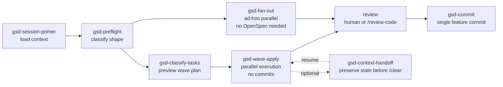

# GSD (Get Shit Done) — Wave Execution

## Family overview

GSD addresses a specific failure mode of long implementation sessions: when a single conversation walks through dozens of independent tasks sequentially, context grows, compresses, and degrades — earlier decisions get lost, irrelevant detail crowds out the next task's spec, and the model spends tokens re-grounding itself instead of writing code. GSD's answer is wave execution: a planner classifies each task by complexity, groups independent tasks into waves, and dispatches each wave to fresh-context subagents in parallel. Each subagent only sees the artifacts it actually needs.

GSD is **optional** and complements the OpenSpec flow rather than replacing it. The standard `/opsx:apply` path remains the default; GSD is an alternate `apply` path you reach for when a change has many independent tasks that benefit from parallelism and context isolation. The exploration, proposal, review, and archive phases are unchanged.

The family expects model-tier routing — sonnet for tier 1-3 tasks (single-file edits, find/replace, add a section, write a component), opus for tier 4-5 tasks (multi-file coordination, architectural patterns, refactors), and haiku for review/verification. It also enforces a no-commits-during-execution discipline: every wave leaves changes uncommitted so that `/gsd-commit` can produce a single feature-level commit at the end, instead of scattering dozens of micro-commits across the wave run.

## Composition

The skills compose into a linear pipeline with checkpoints and utilities. `gsd-session-primer` front-loads context at session start. `gsd-preflight` classifies the session shape and orchestration strategy. `gsd-classify-tasks` previews the wave plan so you can sanity-check tier assignments. `gsd-wave-apply` executes waves in parallel. `gsd-fan-out` provides the same parallelism for ad-hoc work without OpenSpec artifacts. After execution, `/gsd-commit` produces a single feature commit. `gsd-context-handoff` preserves state before `/clear`.

## gsd-classify-tasks

### Purpose
Analyze an OpenSpec change's `tasks.md` and produce a structured execution plan with a dependency graph, wave groupings, tier classifications (1-5), and per-task model routing.

### When to use
Run before `gsd-wave-apply` when you want to preview the wave plan, sanity-check tier assignments, and see estimated token budget and parallel savings before committing to the run.

### When to skip
Skip when the change has only a handful of tasks, when tasks are obviously sequential (each depends on the prior), or when you trust `gsd-wave-apply` to classify on the fly.

### Inputs
Change name (optional — inferred from active change). The skill reads `tasks.md` from the active change.

### Outputs
A markdown execution plan with one table per wave, columns for task ID, tier, model, context budget, and files, plus a summary of total tasks, wave count, estimated wall-clock, token budget, and parallel savings vs. standard apply.

### Dependencies
Requires an active OpenSpec change with a parseable `tasks.md` organized into numbered groups (1.x, 2.x, 3.x...).

### Example invocations
- `/gsd-classify-tasks`
- `/gsd-classify-tasks <change-name>`

### Source
`skills/gsd-classify-tasks/SKILL.md`

## gsd-wave-apply

### Purpose
Execute OpenSpec tasks in waves using context-isolated parallel subagents. Each subagent receives only the artifacts its tier requires, updates `tasks.md` checkboxes as it goes, and leaves all changes uncommitted for `/gsd-commit` to bundle.

### When to use
Use instead of standard `/opsx:apply` when a change has many independent tasks that can parallelize across waves, when context isolation matters, or when you want fresh-context execution to avoid the long-conversation degradation that hits sequential apply.

### When to skip
Skip for small changes where one sequential pass is faster than the wave overhead, for changes whose tasks are heavily inter-dependent (only one task per wave), or when you specifically want a single conversation that maintains continuity across all tasks.

### Inputs
Change name (optional — inferred from context or prompted). The skill loads artifacts via `openspec status` and `openspec instructions apply`.

### Outputs
A wave-by-wave completion report listing tasks completed, any failed tasks with error context, overall progress, and a suggestion to run `/gsd-commit`. The working tree contains all implementation, test, and `tasks.md` edits — uncommitted.

### Dependencies
Requires an OpenSpec change with `tasks.md`, `design.md`, and spec files. The verification/test wave (last numbered group) runs sequentially in the main context with a 3-iteration fix loop, never parallelized.

### Example invocations
- `/gsd-wave-apply`
- `/gsd-wave-apply <change-name>`

### Source
`skills/gsd-wave-apply/SKILL.md`

## gsd-commit

### Purpose
Read the change's `proposal.md`, `design.md`, and `tasks.md`, inspect the diff, and compose a single feature-level commit message in conventional-commits format with a verb-phrase subject (max 72 chars), a 3-7 bullet summary of outcomes, a `Change:` footer, and an optional `Refs:` footer for an issue reference.

### When to use
Run after `gsd-wave-apply` (and any review) to bundle all uncommitted changes — implementation, tests, and `tasks.md` updates — into one feature commit. Pass an issue reference if you have one (GitLab `#123` or `group/project#123`, Jira `PROJ-456`, or comma-separated multiples).

### When to skip
Skip if you want multiple commits per change, if you've already committed during the run, or if you prefer to write the message manually.

### Inputs
Change name (optional — inferred from current branch like `feat/<name>`) and an optional issue reference for the `Refs:` footer.

### Outputs
A previewed commit message (user confirms before committing), followed by the actual commit and a report of commit hash, subject, and files-changed count, plus a suggested next step (`/review-code` or `/opsx:archive`).

### Dependencies
Requires an active OpenSpec change with readable artifacts and a working tree containing the changes from `gsd-wave-apply`. Will not stage unrelated files (`.env`, editor configs).

### Example invocations
- `/gsd-commit`
- `/gsd-commit <change-name>`
- `/gsd-commit <change-name> #142`

### Source
`skills/gsd-commit/SKILL.md`

## gsd-context-handoff

### Purpose
Save session state to `.claude/handoff/<change-name>-<timestamp>.md` so a fresh session can resume after `/clear` without losing the active change name, progress, key decisions, modified files, blockers, and next steps.

### When to use
Run before `/clear` between phases of a long change, or when context is getting heavy mid-wave and you want to reset without losing continuity.

### When to skip
Skip when you're about to commit and finish — `/gsd-commit` plus the change archive already preserve the durable state. Skip for short sessions where context isn't pressured.

### Inputs
None required — the skill summarizes state from the current session.

### Outputs
A handoff markdown file at `.claude/handoff/<change-name>-<timestamp>.md` with sections for Progress, Decisions Made, Files Modified, Issues/Blockers, and Next Steps, plus a printed instruction telling you how to resume after `/clear`.

### Dependencies
None beyond a writable `.claude/handoff/` directory and an active session worth preserving.

### Example invocations
- `/gsd-context-handoff`

### Source
`skills/gsd-context-handoff/SKILL.md`

## gsd-session-primer

### Purpose
Load project context at session start and produce a concise status briefing with a readiness assessment for expert-level execution.

### When to use
At the start of any session, especially when resuming work or when you want to verify all preconditions are met before executing.

### When to skip
Skip when you already have full context (e.g., continuing immediately after a brief /clear with handoff).

### Inputs
None — reads from project state.

### Outputs
A 5-8 line briefing covering branch state, last activity, active change progress, uncommitted files, resume hint, and next suggested action. Includes a readiness score (N/5 expert-session preconditions met).

### Source
`skills/gsd-session-primer/SKILL.md`

## gsd-preflight

### Purpose
Classify the session into a shape (plan-execute, structured-execute, investigate-propose, targeted-fix) and emit a constraint block that downstream skills consume. Ensures producing sessions start with explicit scope, orchestration strategy, and loaded constraints.

### When to use
Fires automatically via carl-dispatch for producing actions (propose, apply, wave-apply, fix, explore-deep). You don't invoke it directly.

### When to skip
Skipped automatically for read-only skills (primer, explain, metrics, explore-light, archive).

### Inputs
User intent + pre-flight context from carl-dispatch.

### Outputs
A structured constraint block (shape, scope, orchestration decision, loaded constraint sources, task-tracking requirement) that the target skill reads as prefix context.

### Source
`skills/gsd-preflight/SKILL.md`

## gsd-fan-out

### Purpose
General-purpose parallel execution for ad-hoc work that doesn't require OpenSpec artifacts. Decomposes a goal into 2-5 independent file-disjoint subtasks, dispatches subagents in parallel, verifies combined results.

### When to use
When carl-dispatch detects parallelizable work outside the OpenSpec lifecycle: applying a pattern across multiple files, fixing multiple independent bugs, code cleanup across modules, or any 2-5 piece decomposable task.

### When to skip
Skip for single-file changes (no overhead benefit), coupled tasks with dependencies, work needing design decisions, or tasks with >5 pieces (use wave-apply with proper artifacts instead).

### Inputs
User's goal (natural language) + optional `--no-confirm` flag.

### Outputs
A completion report per subtask, combined verification result, and suggestion to commit.

### Source
`skills/gsd-fan-out/SKILL.md`
