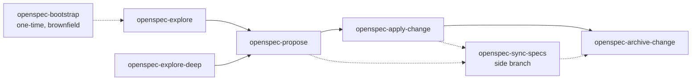

# OpenSpec

## Family overview

The OpenSpec skill family addresses a recurring problem in AI-collaborative coding: prompts produce code, but they don't produce a durable record of *what* was decided, *why*, or *how* it should behave. Without that record, every subsequent change starts from scratch — re-discovering constraints, re-arguing tradeoffs, and drifting from the codebase's original intent. OpenSpec fixes this by treating each change as a small, structured artifact (proposal, design, tasks, delta specs) that lives alongside the code and gets archived once shipped.

The family members compose into a canonical seven-phase flow: **explore → propose → review-artifacts → apply → review-code → archive**, with **bootstrap** as a one-time onramp for codebases that arrive without specs. Each phase has a clear input and a clear output, and each artifact is generated against a schema that the `openspec` CLI enforces. This means an AI agent and a human can hand off mid-flight without losing context — the artifacts hold the state.

What differentiates this approach from ad-hoc prompt-driven editing is the separation between **deciding** and **doing**. Explore and propose force you to articulate intent before code is touched; apply restricts itself to what was already specified; archive locks in the result. Reviews sit between phases as gates. The result is fewer "wait, why did we build it this way?" moments — and a paper trail that compounds over time.

## Composition

Most flows start with `openspec-explore` (or `openspec-explore-deep` for breadth-heavy investigations), graduate into `openspec-propose` once the shape is clear, run through `openspec-apply-change` to implement, and end at `openspec-archive-change`. `openspec-bootstrap` is a one-time onramp for brownfield codebases. `openspec-sync-specs` is a side branch — it applies a change's delta specs back to the canonical specs without archiving, useful when you want main specs current before the change itself is finished.

## openspec-bootstrap

### Purpose
Generate an initial architecture document and a spec per discovered feature for a brownfield codebase that has working code but no OpenSpec specs. Gives later phases full awareness of what already exists.

### When to use
The first time you set up OpenSpec on an existing project, or when joining a codebase with no specs and needing a structured understanding before the first change.

### When to skip
Skip on greenfield projects (no code yet) and on codebases that already have comprehensive specs covering the features you care about.

### Inputs
Optional `--quick` flag (sequential, lighter analysis for small repos) and optional `--scope <path>` to limit analysis to a subdirectory. No arguments runs the full parallel workflow.

### Outputs
`openspec/initial-architecture.md` (snapshot of current architecture, patterns, and inferred design decisions), one `openspec/specs/<feature>/spec.md` per discovered feature, and an updated `openspec/config.yaml` with discovered project context.

### Dependencies
Requires the `openspec` CLI. Full mode benefits from a workflow runner that supports parallel subagents; quick mode runs entirely in the current context.

### Example invocations
- `/openspec-bootstrap`
- `/openspec-bootstrap --quick`
- `/openspec-bootstrap --scope src/features/billing`

### Source
`skills/openspec-bootstrap/SKILL.md`

## openspec-explore

### Purpose
A thinking-partner stance for working through ideas, investigating problems, and clarifying requirements before committing to a change. Reads code freely but never writes application code.

### When to use
Whenever you want to think through something before formalizing it — at the start of a new change, mid-implementation when something feels off, or when comparing options.

### When to skip
Skip when the work is well-defined and you are ready to propose, or when you only need a quick factual lookup that doesn't warrant a thinking session.

### Inputs
A free-form question or topic. Optionally a change name when picking up an in-flight change to ground the conversation in existing artifacts.

### Outputs
No required artifact. The session may produce conversational clarity, ASCII diagrams, comparison tables, or — if the user asks — captured updates to `proposal.md`, `design.md`, `specs/`, or `tasks.md` in an existing change.

### Dependencies
Requires the `openspec` CLI for context lookups (`openspec list --json`, `openspec status --change`).

### Example invocations
- `/openspec-explore "should background jobs be queued or run inline"`
- `/openspec-explore add-search-feature`
- `/openspec-explore "the auth layer feels tangled"`

### Source
`skills/openspec-explore/SKILL.md`

## openspec-explore-deep

### Purpose
Same thinking stance as standard explore, but automatically fans out parallel read-only investigators when the question is broad enough to warrant breadth — multiple subsystems, comparative research, cross-cutting traces, or impact analysis.

### When to use
When a question crosses multiple subsystems, requires comparing several options, or asks how a concept flows end-to-end across the codebase.

### When to skip
Skip for conversational follow-ups, single-file questions, quick clarifications, and iterative refinement where each step informs the next.

### Inputs
A free-form question. The skill decides autonomously whether to fan out or stay single-threaded based on signals in the question.

### Outputs
A synthesized briefing — diagrams, comparison tables, and identified gaps — built from 2-5 parallel investigators. Never a raw dump of agent output.

### Dependencies
Requires the `openspec` CLI and a runtime that supports parallel read-only subagents.

### Example invocations
- `/openspec-explore-deep "how does deployment work end-to-end"`
- `/openspec-explore-deep "what would break if we changed the user schema"`
- `/openspec-explore-deep "what are our options for real-time sync"`

### Source
`skills/openspec-explore-deep/SKILL.md`

## openspec-propose

### Purpose
Create a new change and generate every artifact required for implementation in a single step — proposal (what and why), design (how), tasks (steps), and any delta specs.

### When to use
Once exploration has crystallized into a concrete change you want to build. The fastest path from "I know what I want" to "ready for apply".

### When to skip
Skip when requirements are still vague — go back to explore. Also skip if a change with the same name already exists and you intend to continue it.

### Inputs
Either a kebab-case change name or a free-form description the skill will derive a name from. The skill prompts for clarification if the input is too thin to proceed.

### Outputs
A new change directory under the planning home with all artifacts required by the schema's `apply.requires` (typically `proposal.md`, `design.md`, `tasks.md`, and delta specs).

### Dependencies
Requires the `openspec` CLI. Reads any existing specs and project context from `openspec/config.yaml` to ground the proposal.

### Example invocations
- `/openspec-propose "add dark mode toggle"`
- `/openspec-propose add-rate-limiting`
- `/openspec-propose "let users export their data as CSV"`

### Source
`skills/openspec-propose/SKILL.md`

## openspec-apply-change

### Purpose
Implement the tasks defined in a change's `tasks.md`, reading every required context artifact first and checking off tasks as they complete. The only phase that writes application code.

### When to use
Once a change has all `applyRequires` artifacts complete and you are ready to build. Can also be invoked to continue a partially-implemented change.

### When to skip
Skip if artifacts are incomplete (run propose or finish them manually first), or if implementation has revealed a design issue that warrants updating artifacts before more code is written.

### Inputs
Optional change name. If omitted, the skill infers from conversation context, auto-selects when only one active change exists, or prompts for selection.

### Outputs
Source code changes scoped to each task, with `tasks.md` checkboxes flipped from `- [ ]` to `- [x]` as work completes. Pauses on ambiguity or blockers rather than guessing.

### Dependencies
Requires the `openspec` CLI. Reads context files declared by `openspec instructions apply --json`.

### Example invocations
- `/openspec-apply-change`
- `/openspec-apply-change add-dark-mode`
- `/openspec-apply-change` (after pausing, to resume)

### Source
`skills/openspec-apply-change/SKILL.md`

## openspec-archive-change

### Purpose
Finalize a completed change by moving it into the archive directory under a dated name, optionally syncing its delta specs into the canonical specs along the way.

### When to use
After implementation is complete and reviewed — typically the last step in the seven-phase flow. Also acceptable with incomplete artifacts or tasks if the user explicitly confirms.

### When to skip
Skip if the change is still being implemented, if delta specs are out of sync and you want them merged separately first, or if review has surfaced issues that need to be resolved before locking the change.

### Inputs
Optional change name. The skill always prompts for selection if not provided — it never auto-selects.

### Outputs
The change directory moved to `<changesDir>/archive/YYYY-MM-DD-<name>/`, optionally with delta specs synced into `openspec/specs/<capability>/spec.md` if the user accepts the prompt.

### Dependencies
Requires the `openspec` CLI. May invoke `openspec-sync-specs` as a sub-step when the user opts in.

### Example invocations
- `/openspec-archive-change`
- `/openspec-archive-change add-dark-mode`

### Source
`skills/openspec-archive-change/SKILL.md`

## openspec-sync-specs

### Purpose
Apply a change's delta specs (ADDED / MODIFIED / REMOVED / RENAMED requirements) back into the canonical main specs through intelligent merging — without archiving the change.

### When to use
When you want main specs to reflect the current change before the change itself is archived, or when a long-running change has delta specs you want available to other in-flight work.

### When to skip
Skip if the change has no delta specs, if you plan to archive immediately (archive offers the same sync as a sub-step), or if the delta represents work that may still be revised.

### Inputs
Optional change name. The skill prompts for selection from changes that have delta specs if not provided.

### Outputs
Edits to existing `openspec/specs/<capability>/spec.md` files (or new spec files for previously undocumented capabilities), preserving content not mentioned in the delta. The change itself remains active.

### Dependencies
Requires the `openspec` CLI. Operates as an agent-driven merge rather than a programmatic patch — the agent reads both delta and main specs and applies partial updates.

### Example invocations
- `/openspec-sync-specs`
- `/openspec-sync-specs add-dark-mode`

### Source
`skills/openspec-sync-specs/SKILL.md`
