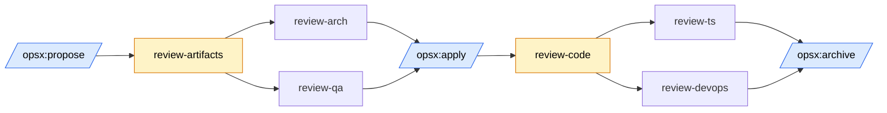

# Review

## Family overview

The Review family provides multi-perspective review gates that flank the two highest-leverage moments in the OpenSpec flow: just after a change is proposed (before any code is written) and just after a change is applied (before it is archived). Catching architectural confusion or missing edge cases at the artifact stage costs minutes; catching the same issues after implementation costs hours of rework. Catching deploy-readiness issues before archive prevents broken builds and missing env vars from landing on main.

All reviewers share a standardized severity framework so verdicts are comparable across personas:

- **BLOCKER** — must fix before proceeding. The gate fails.
- **WARNING** — should fix; reviewer flags a concrete file/line and recommends action.
- **SUGGESTION** — optional improvement; safe to defer.

Reviewers also share a standardized output format: a header bar naming the persona, then `✓` passed items, `⚠` warnings, `✗` blockers, and a final `Verdict` or `SUMMARY` line. Canonical placement: `review-artifacts` runs after `/opsx:propose` and gates `/opsx:apply`; `review-code` runs after `/opsx:apply` and gates `/opsx:archive`. Individual personas can also be invoked directly when only one perspective is needed.

## Composition

Two composite gates orchestrate four single-persona reviewers. Each composite runs its sub-reviewers in sequence with independent personas, then aggregates verdicts. Individual reviewers remain available for targeted use — for example running `review-ts` mid-implementation, or re-running `review-qa` after editing specs.

## review-artifacts

### Purpose
Run both artifact-stage personas (Frontend Architect + QA Expert) against an OpenSpec change before implementation begins, surfacing architecture and spec-completeness issues while they are still cheap to fix.

### When to use
Immediately after `/opsx:propose` finishes, or any time the proposal/specs/design/tasks for an active change have been edited and you want the combined verdict before applying.

### When to skip
The user explicitly says "skip review", "straight to apply", or the change is trivial (e.g., a typo fix with no behavioral impact).

### Inputs
The active change directory at `openspec/changes/<change-name>/`, specifically `proposal.md`, `specs/**/*.md`, `design.md`, and `tasks.md`. Optional `$ARGUMENTS` to target a non-active change.

### Outputs
Two stacked persona reports (architect, then QA) followed by a `SUMMARY: N blockers, N warnings, N suggestions` line and a recommendation to fix blockers, address warnings, or proceed to `/opsx:apply`.

### Dependencies
Internally invokes `review-arch` and `review-qa` personas. Requires an active OpenSpec change with artifacts already generated.

### Example invocations
- `/review-artifacts` (review the active change)
- `/review-artifacts add-dark-mode` (review a specific change by name)

### Source
`skills/review-artifacts/SKILL.md`

## review-arch

### Purpose
Single-persona architectural review of OpenSpec artifacts, focused on component boundaries, state and data-flow decisions, design completeness (errors, accessibility), and pattern fitness against existing codebase conventions.

### When to use
When you only want the architecture lens — for example after revising `design.md` in response to QA feedback, or when the change is heavily structural and spec-completeness is already known to be solid.

### When to skip
Trivial proposals with no design implications, or when running the composite `review-artifacts` (which already includes this persona).

### Inputs
`proposal.md`, `specs/`, `design.md`, and `tasks.md` from the active change directory; optional `$ARGUMENTS` to target a specific change.

### Outputs
A single `── FRONTEND ARCHITECT ──` block with `✓`/`⚠`/`✗` items and a `Verdict: proceed / fix warnings / fix blockers` line. Findings reference specific files and sections.

### Dependencies
Active OpenSpec change with `design.md` present. Project-level architecture rules (e.g., a `CLAUDE.md`) are used as the reference standard if available.

### Example invocations
- `/review-arch`
- `/review-arch add-payments-flow`

### Source
`skills/review-arch/SKILL.md`

## review-qa

### Purpose
Single-persona QA review of OpenSpec artifacts, focused on spec completeness (Given/When/Then coverage, edge cases), testability of acceptance criteria, task quality (test task per feature task, ordering, sizing), and correct delta-spec usage.

### When to use
When you want the QA lens in isolation — for example after adding new scenarios to `specs/` and wanting confirmation they are testable before implementing.

### When to skip
Pure refactors with no observable behavior change, or when running the composite `review-artifacts`.

### Inputs
`proposal.md`, `specs/`, `design.md`, and `tasks.md` from the active change directory; optional `$ARGUMENTS` for a specific change.

### Outputs
A single `── QA EXPERT ──` block with `✓`/`⚠`/`✗` items keyed by file name and requirement ID, plus a `Verdict` line.

### Dependencies
Active OpenSpec change. Specs should follow Given/When/Then form for the reviewer to evaluate scenarios meaningfully.

### Example invocations
- `/review-qa`
- `/review-qa add-export-csv`

### Source
`skills/review-qa/SKILL.md`

## review-code

### Purpose
Run both implementation-stage personas (TypeScript/Frontend + DevOps) against the diff for an applied OpenSpec change, verifying both code-quality and deploy-readiness before archive.

### When to use
Immediately after `/opsx:apply` completes, or when implementation has been amended (additional commits, fixes for prior review feedback) and you want a fresh combined verdict before archiving.

### When to skip
The user explicitly says "skip review" or "archive now", or the change has been reviewed and only documentation tweaks have happened since.

### Inputs
`tasks.md` from the active change for the checklist, plus the working-tree diff (via `git diff` / `git status`) of source and test files. Artifact files, lock files, and config noise are filtered out.

### Outputs
Two stacked persona reports (TypeScript/Frontend, then DevOps — or `Skipped` for UI-only changes) followed by a `SUMMARY` and recommendation to fix blockers, address warnings, or proceed to `/opsx:archive`.

### Dependencies
Internally invokes `review-ts` and `review-devops`. Requires an active OpenSpec change with implementation already in the working tree.

### Example invocations
- `/review-code`
- `/review-code add-dark-mode`

### Source
`skills/review-code/SKILL.md`

## review-ts

### Purpose
Single-persona TypeScript and frontend correctness review of implementation diffs. Applicable to any TypeScript project: covers task completion against `tasks.md`, type safety (no `any`, justified `as` casts, runtime validation at boundaries, public-API return types), framework patterns (hook correctness, component-boundary respect, prop-drilling limits, error boundaries), performance hygiene, and test quality (behavior-focused, accessible queries, specific assertions).

### When to use
When you want the code-quality lens in isolation — for example mid-implementation to validate a tricky module before continuing, or after fixing prior review feedback to confirm the fixes landed.

### When to skip
Pure config or documentation changes with no TypeScript surface area, or when running the composite `review-code`.

### Inputs
`tasks.md` from the active change, plus the working-tree diff of source and test files.

### Outputs
A `── TYPESCRIPT / FRONTEND EXPERT ──` block with `✓`/`⚠`/`✗` items referencing exact file paths and line numbers, plus a `Verdict` line.

### Dependencies
Active OpenSpec change with implementation in the working tree. Project conventions (style, hook rules, framework patterns) are read from any project-level instructions file if present.

### Example invocations
- `/review-ts`
- `/review-ts add-search-filter`

### Source
`skills/review-ts/SKILL.md`

## review-devops

### Purpose
Single-persona review of infrastructure and operational concerns in an implementation diff: environment variables and config hygiene, dependency justification and vulnerability surface, security on new endpoints (auth, input validation, sensitive data exposure), and build health (build success, no suppressed type errors, reasonable bundle impact).

### When to use
When the change touches backend surface area — new API routes, env vars, dependencies, or infra config — and you want to confirm deploy-readiness independently of code-quality concerns.

### When to skip
The change is purely UI/frontend with no new API routes, env vars, dependencies, or infra config. The skill self-skips in this case and emits a `Skipped (UI-only change, no infra impact)` line.

### Inputs
The working-tree diff (via `git diff` / `git status`). Reads `.env.example`, dependency manifests, and changed source files for endpoints.

### Outputs
A `── DEVOPS ──` block with `✓`/`⚠`/`✗` items and a `Verdict` line — or a single `Skipped` line when the change has no infra impact.

### Dependencies
Implementation diff present in the working tree. Optional access to a package-manager audit command (e.g., `pnpm audit`, `npm audit`) for vulnerability checks.

### Example invocations
- `/review-devops`
- `/review-devops add-webhook-endpoint`

### Source
`skills/review-devops/SKILL.md`
